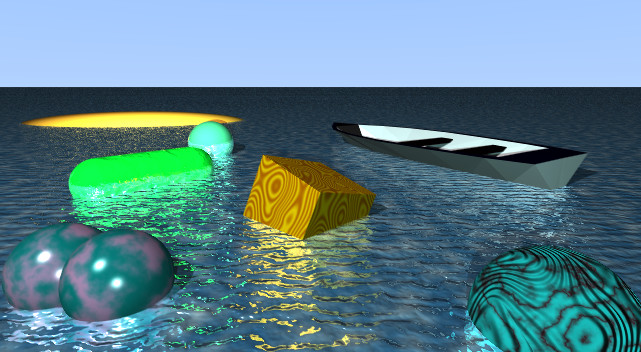
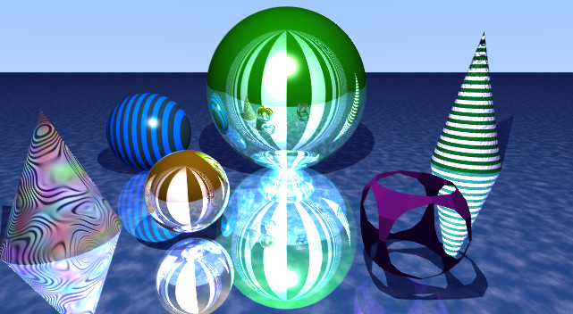
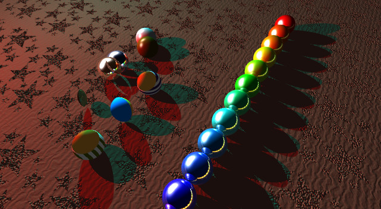
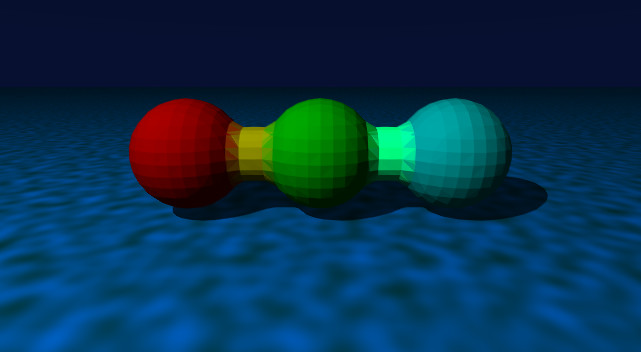

# Raytracer project

ING2 - IMAGE

Use json library to parse scenes from json files.
https://github.com/nlohmann/json

# Features
* Primitives: capped cone, capsule, cone, cube, cylinder, ellipsoid, plane, sphere, torus, holed plane
* Reflection & Refraction
* CSG: union, intersection, substract, minus
* Blobs: with smooth triangle or not
* Textures:
    * Strip (planar/spherical)
    * Checkerboard texture
    * Metal
    * Lambertian
    * Image mapping
    * Perlin noise (noise, turbulence, wood, marble, rainbow, cloud)
* Bump mapping (noise, turbulence, wood, marble)
* Bump / Displacement mapping on plane using any image
* Lights: point, ambient
* Supersampling
* Obj loader
* Add fog (linear, exp, square exp)
* Blur from camera
* Soft shadow

# Images

